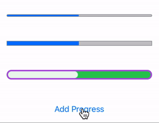
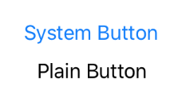
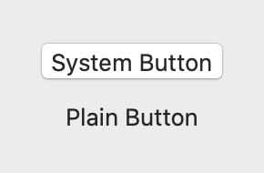
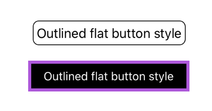

# Reusable-SwiftUI-Components
A set of UI components written in SwiftUI 

This library is released free of charge under the MIT license.

## ProgressBar
```swift
// Default
ProgressBar(progress: self.progress).frame(width: 300)

// Taller, square bar
ProgressBar(progress: self.progress, cornerRadius: 0, barHeight: 10)
        .frame(width: 300)

// Party
ProgressBar(progress: self.progress,  
            cornerRadius: 10, 
            panColor: .green, 
            panBorderColor: .purple, 
            panBorderWidth: 3, 
            fillColor: Color.white.opacity(0.9), 
            barHeight: 20)
    .frame(width: 300)
```



## PlainButtonStyle
This makes more of a difference on macOS than iOS, and was built to replace `.borderlessButtonStyle()` when it was removed in Xcode 11 Beta 2. Hopefully, the next beta will give me a reason to delete this. 😊

In the images, I added a system default button for reference.

```swift
Button(action: {}) {
    Text("Plain Button")
}.buttonStyle(.plain)
```


iOS:



macOS:



## OutlinedFlatButtonStyle
These come with the default press/tap animation on iOS. On macOS, you can use the struct `OutlinedFlatButtonWithHover` to define an appearance to show on hover as well.

```swift
// Default look
Button(action: {}) {
    Text("Outlined flat button style")
}.buttonStyle(.outlinedFlat())

// Party
Button(action: {}) {
    Text("Outlined flat button style")
        .color(.white)
        .font(.subheadline)
    }.buttonStyle(.outlinedFlat(appearance: OutlinedFlatButtonStyle.Appearance(borderColor: .purple, 
                                                                                borderWidth: 4, 
                                                                                contentVerticalPadding: 10, 
                                                                                contentHorizontalPadding: 20, 
                                                                                backgroundColor: .black, 
                                                                                cornerRadius: 0)))
```


